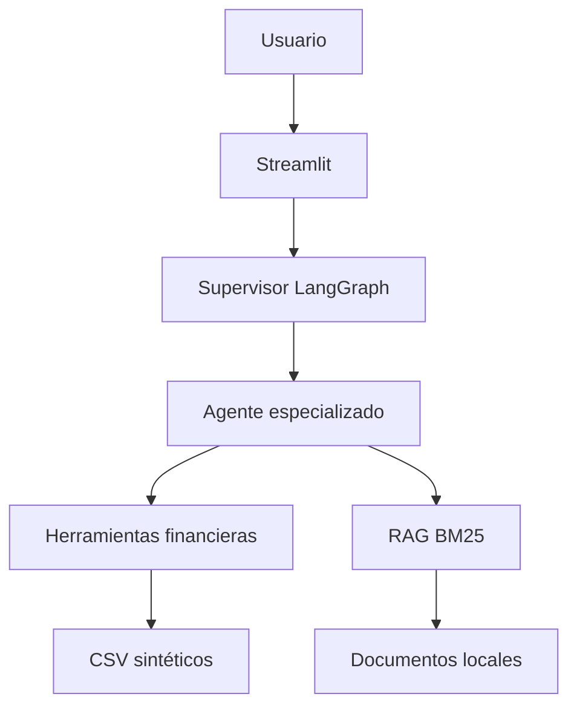

# Financial Multi-Agent

Prototipo local de un asistente financiero multiagente para una empresa de servicios B2B. El sistema enruta cada consulta al especialista adecuado, ejecuta herramientas sobre datos sintéticos y redacta una respuesta con un modelo local de Ollama.

El proyecto demuestra orquestación con LangGraph, análisis financiero reproducible, recuperación documental con BM25 y exposición de herramientas mediante servidores MCP. No utiliza datos reales ni representa a una empresa concreta.

## Casos de uso

- Consultar posición de caja, deuda y pagos próximos.
- Analizar facturas vencidas, morosidad y aging de clientes.
- Revisar balance, cuenta de resultados y ratios.
- Comparar presupuesto y resultados reales.
- Consultar normativa incluida en la base documental, mostrando la fuente.
- Revisar activos, amortizaciones y mantenimientos.

## Arquitectura



El supervisor aplica primero reglas deterministas y, si ninguna coincide, pide al LLM que clasifique la consulta. La selección manual tiene prioridad y está validada mediante pruebas unitarias.

### Agentes

| Agente | Responsabilidad principal |
|---|---|
| Director financiero | Resumen ejecutivo y visión consolidada |
| AR Manager | Facturación, cobros, aging y morosidad |
| Tesorero | Caja, pagos, deuda y liquidez |
| Controller | Balance, resultados y ratios contables |
| FP&A Analyst | KPIs, presupuesto y desviaciones |
| Fiscalista | IVA y calendario fiscal de demostración |
| Gestor de activos | Inventario, amortización y mantenimiento |

## RAG y fuentes

El módulo `rag/rag_system.py` crea en memoria un índice BM25 sobre los Markdown de `rag/documentos/`. No requiere una base vectorial persistente y devuelve el nombre del documento junto con cada fragmento recuperado.

Los documentos incluidos son material resumido para una demostración técnica. Las respuestas fiscales o contables deben verificarse siempre contra fuentes oficiales vigentes.

## MCP: alcance real

El repositorio incluye dos servidores MCP ejecutables por `stdio`:

- `mcp_servers/financial_data_server.py`: caja, pagos, deuda, balance y resultados.
- `mcp_servers/collections_server.py`: facturas, clientes, aging y previsión de cobros.

La interfaz Streamlit utiliza herramientas LangChain locales equivalentes para evitar gestionar procesos asíncronos dentro de la aplicación. Por tanto, los servidores MCP se pueden probar de forma independiente, pero no son el transporte utilizado por el chat de Streamlit en la versión actual.

`mcp_config.json` contiene además un ejemplo de configuración de un servidor MCP de filesystem restringido a `./data`.

## Datos sintéticos

`generar_datos.py` genera de manera determinista los CSV utilizados por la aplicación. Los CSV no se versionan porque pueden reconstruirse y así se evita confundirlos con información real:

- 400 clientes ficticios y ocho meses de facturación.
- Comportamientos de pago normal, retrasado y vencido.
- Caja, deuda, pagos, balance, resultados, KPIs y activos.
- Cinco unidades de negocio con capacidad y utilización.

Los archivos de `data/` usan coma como separador, punto decimal y fechas ISO para facilitar su lectura por código. La copia opcional de `datos_informe_manual/` usa punto y coma, coma decimal y fechas españolas para abrirla en Excel.

```bash
python generar_datos.py
```

## Instalación y ejecución

Requisitos: Python 3.10 o superior y [Ollama](https://ollama.com/).

```bash
python -m venv .venv

# Linux/macOS
source .venv/bin/activate

# Windows PowerShell
# .venv\Scripts\Activate.ps1

pip install -r requirements.txt
ollama pull qwen2.5:7b
python generar_datos.py
streamlit run app.py
```

Ollama debe estar activo mientras se utiliza el chat. El dashboard y la generación de datos no requieren conexión a servicios externos.

## Pruebas

```bash
pip install -r requirements-dev.txt
pytest -q
```

GitHub Actions ejecuta las pruebas de enrutamiento y compila todos los módulos Python en cada pull request.

## Estructura

```text
.
├── app.py                       # Dashboard y chat Streamlit
├── generar_datos.py             # Generador reproducible
├── agents/tools/                # Herramientas por función financiera
├── graphs/
│   ├── financial_graph.py       # Orquestación LangGraph
│   └── routing.py               # Reglas deterministas comprobables
├── mcp_servers/                 # Servidores MCP y adaptadores locales
├── rag/                         # Recuperación BM25 y documentos
├── data/                        # Datos ficticios reproducibles
└── tests/                       # Pruebas automatizadas
```

## Limitaciones

- El LLM se ejecuta localmente y la calidad depende del modelo instalado.
- Los indicadores macroeconómicos incluidos en las herramientas son datos de demostración, no información en tiempo real.
- El proyecto no sustituye una validación contable, fiscal o financiera profesional.
- La aplicación no mantiene memoria persistente ni controles de acceso de producción.

## Licencia

MIT.
